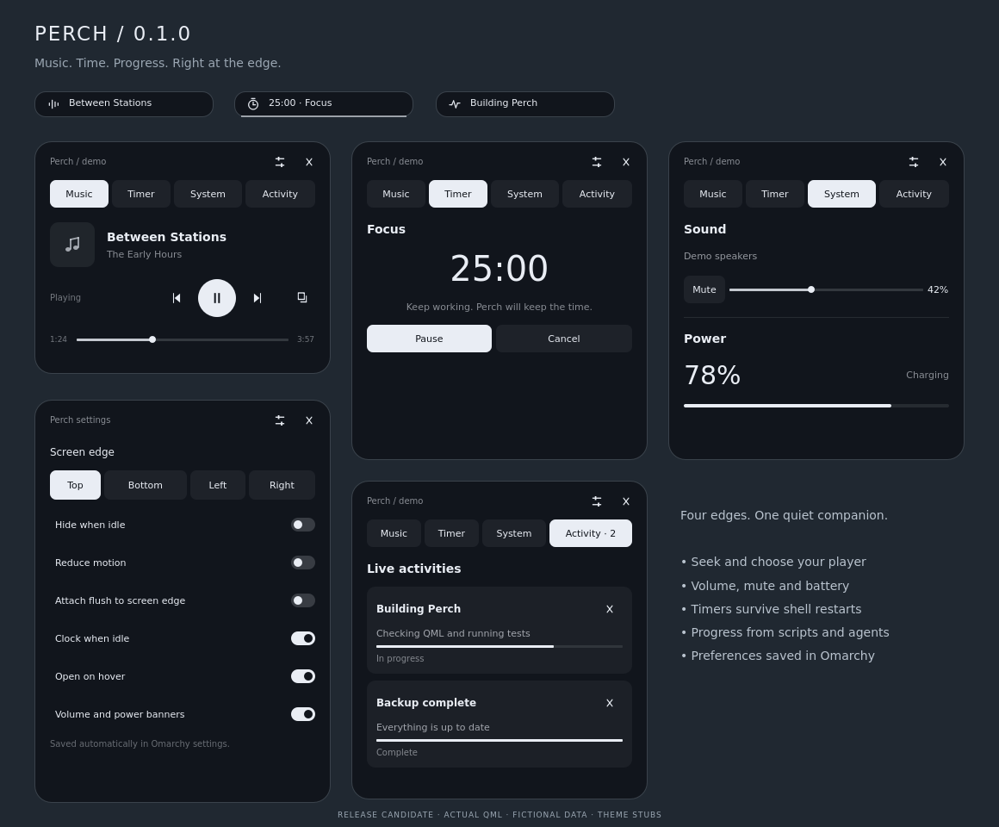

# Perch

[](https://github.com/tcballard/omarchy-badges)

Music, timers and live progress at any edge of your Omarchy desktop. A small pill opens into the controls you need, then gets out of the way.

**v0.1.0-rc.1 — release candidate.** The smoother base interaction is confirmed on the XPS. The new persistence, timer, audio and activity features pass portable/Qt fixture tests and are awaiting the live release checks in [TESTING.md](TESTING.md). No stable tag or marketplace claim yet.



## What you get

- **Four edges:** top, bottom, left or right; slim upright side tabs; optional flush attachment. Choose an edge without closing Settings.
- **Music:** title, artist, local artwork, previous/play/pause/next, seek when supported, and a named player picker with automatic selection. Click artwork to raise a player that supports it. Middle-click the compact pill to play/pause.
- **Timers:** 5/15/25-minute presets, custom 1–1440-minute countdowns, pause/resume/cancel, compact progress and a persistent “finished” state. Real timers survive closing Perch and restarting the shell.
- **System:** default audio output volume/mute, battery percentage and charging state. No device means an explicit unavailable state.
- **Live activities:** builds, backups, downloads or agents can report progress through a small IPC API. Cards support running, waiting, complete and failed states, with dismissal and expiry.
- **Persistent preferences:** edge, hide-idle, reduced motion, flush attachment, idle clock, hover opening, and volume/power banners. Saved to Perch’s own entry in Omarchy’s `shell.json` through the host API.

The compact view prioritizes a finished timer or activity needing attention, then short volume/power feedback, a running timer/activity, music, and the clock. It never expands automatically or takes focus to show an update. Fullscreen workspaces suppress Perch until you leave fullscreen.

## Install or update

Requires Omarchy Quattro’s plugin-capable shell with the scoped `updateEntryInline` API, QtQuick Controls/Layouts, Quickshell MPRIS, PipeWire, UPower, IO, Wayland and Hyprland modules, plus Omarchy’s `qs.Commons` and `qs.Ui` modules. These are provided by the target shell; a media player must expose MPRIS for music controls.

```bash
omarchy plugin add https://github.com/tcballard/omarchy-perch.git --enable
```

Existing installation:

```bash
omarchy plugin update io.github.tcballard.perch --yes
omarchy restart shell
```

Open on the focused monitor:

```bash
omarchy-shell shell summon io.github.tcballard.perch
```

Open a particular view:

```bash
omarchy-shell shell summon io.github.tcballard.perch '{"page":"timer"}'
```

`page` accepts `music`, `timer`, `system`, `activity` or `players`. Hover opening stays on the hovered display. Keyboard summons select the focused display. Startup uses the first display; unplugging it falls back to an available display.

## Controls

Hover for 90 ms or click the pill to open. Expansion animates the visible item for 140 ms inside a stable compositor surface. A 220 ms leave grace lets you move between controls. Disable hover opening to require a click; reduced motion disables expansion/fade animation.

Use the tabs for Music, Timer, System and Activity. The sliders icon opens Settings. Escape returns from Settings or another tab to Music, then closes; × always closes. Keyboard summons support Tab navigation and outside-click dismissal.

Hide-idle hides the pill only when there is no player, timer, activity or enabled system banner. A paused player counts as present. A hidden Perch can always be summoned outside fullscreen. The compact waveform is a static playback icon, not an audio-level visualizer.

## Send progress from a script or agent

No automatic browser-download scraping or agent session detection is installed. The producer explicitly reports its state:

```bash
omarchy-shell io.github.tcballard.perch activity '{"id":"build","title":"Building Perch","detail":"Running tests","state":"running","progress":0.65,"ttl":300}'
omarchy-shell io.github.tcballard.perch activity '{"id":"build","title":"Build complete","state":"done","progress":1}'
omarchy-shell io.github.tcballard.perch dismiss build
```

Updating the same `id` replaces that card. Up to eight cards are kept. IDs are 1–64 letters/digits/dots/underscores/hyphens and must start with a letter or digit. Titles are limited to 120 characters, details to 240, and each JSON payload to 4096 characters. All text renders as plain text.

`state` is `running`, `waiting`, `done` or `error`; `waiting` displays “Needs attention”. `progress` is 0–1, or omitted/−1 when unknown. `ttl` is 5–86400 seconds; the default is 300 seconds, or 30 for a completed card. Producers should refresh long-running cards before expiry. Activities are transient and clear on shell restart. They cannot execute commands, open links or grant agent permissions.

An optional Python 3 helper quotes JSON safely and applies a five-second IPC timeout:

```bash
~/.config/omarchy/plugins/io.github.tcballard.perch/scripts/perch-activity build \
  --title 'Building Perch' --detail 'Running tests' --progress 0.65
```

[`examples/build-with-perch.sh`](examples/build-with-perch.sh) wraps a command you explicitly run, reports success/failure, and preserves its exit status. It does not install hooks or change agent configuration.

Timer and diagnostics IPC:

```bash
omarchy-shell io.github.tcballard.perch timer 1500 Focus
omarchy-shell io.github.tcballard.perch cancelTimer
omarchy-shell io.github.tcballard.perch status
```

Starting a timer while one is running/paused is rejected. Status reports state/counts and device availability, not track metadata or activity text.

## State, dependencies and boundaries

Perch runs inside `omarchy-shell`. It launches no background process and uses native MPRIS, PipeWire and UPower data. Media and audio actions happen only on user interaction. The optional command-line helper/demo scripts require Python 3; testing additionally requires Node and PySide6 Essentials 6.11.2.

Perch reads `~/.config/omarchy/shell.json` to find its own entry. It writes only its own preferences and timer state through Omarchy’s scoped settings API; it never rewrites the file itself. Timer transitions save state, not every tick. A missing/malformed settings file produces an error and blocks writes rather than resetting the user’s configuration. Settings over 1 MiB are rejected after reading; FileView itself reads the user-owned file before that check. No credentials are read or stored.

Timers use a saved wall-clock deadline so suspension and shell restarts count toward elapsed time. Changing the system clock can change the remaining time. Completion remains in the pill until dismissed; v0.1.0 has no audible alarm or desktop notification, and fullscreen suppression also applies to finished timers.

Artwork is local `file:///` metadata only, decoded at a bounded requested size. No remote artwork, HTTP calls, telemetry, agent execution, clipboard monitoring or notification replacement. The original bar, notifications, shortcuts and media keys remain in place. System banners may appear alongside Omarchy’s own OSD; they can be disabled in Settings.

## Disable or remove

```bash
omarchy plugin disable io.github.tcballard.perch
omarchy plugin remove io.github.tcballard.perch
```

On the inspected Quattro revision, disabling a third-party plugin removes its configuration entry, so **disable/remove clears Perch preferences and its timer**. Closing the panel or restarting the shell preserves them. Removal uses Omarchy’s plugin lifecycle; there is no separate Perch config, daemon, keybinding or cache to clean up. A Git-managed install’s checkout is removed. A local symlink’s source remains yours.

If you installed the earlier unpublished `io.github.tcballard.omarchy-notch`, remove that registration before installing Perch. Its old source files remain yours.

## Demos and verification

From the checkout, run `./demo/run playing`, `paused`, `empty`, `timer`, `system` or `activity`. Demo playback, seeking, timer and audio controls use isolated fictional state. Preferences apply to the actual Perch placement/behaviour. Closing exits demo mode; it does not alter real playback or the real timer.

```bash
./tests/run
PYTHONPATH=/path/to/pyside6 python3 tests/render_preview.py preview.png Review.qml
```

`preview.png` renders the production QML with fixture data and theme stubs. It is not a desktop screenshot. Tests cover service/view behaviour, bounded IPC, seeking races, persistence failure, timer restoration, unavailable devices, keyboard/pointer controls and edge policy. They do not establish real compositor or DBus behaviour.

Target shell contract: Omarchy quattro `d3cfd53b997f8bdcf776b8db68bf0d735e7a065d`. See [TESTING.md](TESTING.md), [DESIGN.md](DESIGN.md) and [CHANGELOG.md](CHANGELOG.md) for evidence and release boundaries.

[Report a bug](https://github.com/tcballard/omarchy-perch/issues). Include the Perch commit, Omarchy revision and relevant Perch log lines. For sensitive security findings, open a minimal issue requesting a private contact channel; do not post credentials or exploit details publicly.

MIT. Original implementation by Tom Ballard. [Island](https://github.com/Guilhermerisu/island) and [Dynamic Island Pro](https://github.com/harshithnadig/omarchy-dynamic-island) informed the feature comparison; their code is not included. Desktop-menu replacement, a notification inbox, remote artwork and automatic agent/download integrations remain outside v0.1.0.
