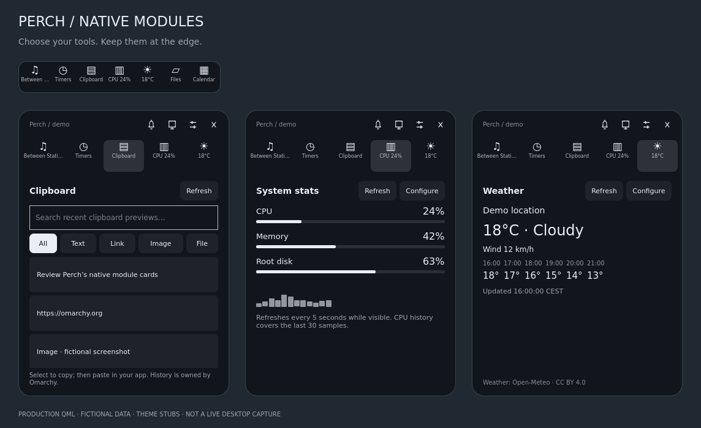

# Perch

[](https://github.com/tcballard/omarchy-badges)

Music, files, meetings, timers and live progress at any edge of your Omarchy desktop. A quiet notch opens into native cards, with an optional strip for your favourite tools and plugins.

**Unreleased: native modules.** Choose a quiet Notch or the visible Plugin Perch strip, with drag/keyboard ordering. Every tool uses the shared native card host, including Clipboard, Stats and Weather. Weather is opt-in; clipboard reuses Omarchy's existing history. [Module contract and exact boundaries](MODULES.md). [Notch and Plugin Perch preview](notch-preview.png).



**v0.1.0-rc.5 — release candidate.** rc.3 added contextual controls, files, calendars, multiple timers, richer system controls and guided setup; rc.4 fixed dropdown input/hover handling, serialized helper jobs, detected outdated companion copies and reported failing setup steps; rc.5 adds a Hyprland global shortcut, page and context transitions, compact artwork, whole-card drag and deferred timer alerts. Portable tests and actual QML fixture rendering pass. The hardware/compositor integrations still need the XPS checks in [TESTING.md](TESTING.md); this is not a stable release or a claim of macOS feature parity. [Scope and boundaries](GAPS.md).


## What you get

- **Tools at the edge:** configurable tiles open their native cards; live labels show music, timer countdowns and module status. Header swipes cycle selected tools. Four edges, monitor pinning, per-display width/offset/edge/fullscreen preferences, reduced motion.
- **Plugin drawer:** pin installed visual plugins alongside built-in tools; click to read a participating plugin's native card inside Perch, or choose Open for its full panel. Reorder in the strip or Settings. Installation and enablement stay with Omarchy. [Card contract](PLUGIN-CARDS.md) · [fixture preview](plugin-drawer-preview.png).
- **Music:** native MPRIS controls, seeking, player selection, local artwork, optional bounded HTTPS artwork, local `.lrc` synchronized lyrics and a full lyrics reader.
- **File shelf:** up to 32 persistent file/folder references, drag in/out, small text/image previews, open, reveal and LocalSend handoff. Removing a reference never deletes its original.
- **Meetings:** agenda, imminent meeting countdown and explicit Join from up to eight local `.ics` files, including files maintained by a calendar sync tool. The compact countdown covers the 15 minutes before a timed meeting and its first 10 minutes; all-day entries stay in the agenda only.
- **Timers:** up to eight named timers, pause/resume/cancel, repeat, snooze, optional completion sounds/desktop notifications. Wall-clock deadlines survive suspension and shell restart.
- **System:** output/input selection, volume/mute, microphone mute, battery, paired Bluetooth connect/disconnect and battery status, optional brightnessctl. Missing capabilities are shown explicitly.
- **Notifications (opt-in):** persistent 20-item history, unread markers, app filtering/muting, DND, icons, native actions and sender-supported replies. A companion replaces the built-in notification owner while enabled.
- **Applications:** six Omarchy shortcuts, installed-app picker, up to eight application pins and eight named HTTP(S) links.
- **Live activities:** bounded IPC, real build/download/copy adapters, Claude Code status hooks and Codex completion hooks. Agent sessions show their project, group attention first and can return to the originating Hyprland window when it can be identified.
- **Setup:** integration status, explicit enable/disable, optional system-feedback companion to replace stock OSD, dependency reporting and coordinated integration removal.

The compact view prioritizes finished timers and activities needing attention, then new notification previews, device feedback, imminent meetings, running timers and music. When activity cards are enabled, new completion or attention events open a dedicated card only while Perch is collapsed, without taking keyboard focus. Open tools and settings stay in place. Completion cards close after eight seconds (extended while hovered); attention cards remain until dismissed, resolved or expired. Fullscreen defaults to hidden; Settings also offers timer/activity alerts or always show.

## Install or update

Requires Omarchy Quattro’s plugin-capable shell with the scoped `updateEntryInline` API, QtQuick Controls/Layouts, Quickshell MPRIS, PipeWire, Bluetooth, UPower, IO, Wayland and Hyprland modules, plus Omarchy’s `qs.Commons` and `qs.Ui` modules. These are provided by the target shell; a media player must expose MPRIS for music controls.

```bash
omarchy plugin add https://github.com/tcballard/omarchy-perch.git --enable
```

Existing installation:

```bash
omarchy plugin update io.github.tcballard.perch --yes
omarchy restart shell
```

Open on the focused monitor:

```bash
omarchy-shell shell summon io.github.tcballard.perch
```

Keyboard shortcut: Perch registers the Hyprland global shortcut `perch:toggle`. Add one line to your Hyprland bindings (for example `~/.config/hypr/bindings.conf`) and reload Hyprland:

```ini
bind = SUPER, P, global, perch:toggle
```

The shortcut opens Perch on the focused display with keyboard focus and closes it if it is open. No binding is written for you. Any key works; if Hyprland or Omarchy already uses your choice, the earlier binding wins, so check with `hyprctl binds | grep -i "global"` and `hyprctl binds | grep -w P`.

Open a particular view:

```bash
omarchy-shell shell summon io.github.tcballard.perch '{"page":"timer"}'
```

`page` accepts `music`, `timer`, `system`, `activity`, `players`, `inbox`, `desktop`, `hub`, `shelf`, `calendar`, `setup`, `clipboard`, `stats` or `weather`. Hover opening stays on the hovered display. Keyboard summons select the focused display unless a monitor is pinned in Settings. Startup uses the first display; unplugging it falls back to an available display.

## Controls

**All tools** opens a searchable list of built-in tools and installed plugins, including unpinned ones. Open a card or pin it from the same row. Disabled plugins stay labelled and cannot open. **Ctrl+K**, while Perch is open, moves to tool search; Enter opens a sole enabled result. Escape from a plugin card returns to All tools.

Under **Placement**, choose Dark island or Follow Omarchy theme; the latter uses the active theme’s foreground/background, including light themes. Appearance can be saved per display. **Alerts & sound** separates activity cards, notification previews, device feedback and sound preferences. Quiet mode pauses automatic activity cards, notification previews, timer notifications and Perch sounds while timers and inbox history continue. Inbox DND also silences Perch sounds. Choose Complete, Message or Bell and preview it explicitly; missing sound support is reported in Settings. Activity sound bursts are coalesced.

Hover a tile for 150 ms or click it to open its card. Expansion and page transitions animate for 140 ms inside a stable compositor surface; reduced motion disables them. A 220 ms leave grace lets you move between controls, and dropdown menus keep Perch open while showing.

Settings is organised into Placement, Behaviour, Media & alerts, Your strip and Plugin pins, with a sidebar on wide panels and compact navigation on narrow displays. Changes save automatically. [Wide and narrow settings preview](settings-preview.png).

Choose and reorder up to eight modules in Settings, drag tiles, or press Ctrl+arrow on a focused tile. Use the strip to switch cards; the bell opens Notifications and the monitor opens All tools, including tools omitted from your strip. Escape returns from Settings or another card to Music, then closes; × always closes. Keyboard summons support Tab navigation and outside-click dismissal. Swipe across the left side of the header to cycle your chosen tools.

Choose **Notch** or **Plugin Perch** under Settings → Behaviour. Notch is the default and shows one context: completed timer, activity needing attention, selected timer, playing media, meeting, notification or activity. Click/hover opens its card; idle opens All tools. Plugin Perch keeps your chosen tiles visible. Both retain the same expanded cards and pins. Explicitly saved strip preferences stay on Plugin Perch; old pill preferences use Notch. Fullscreen and monitor policies apply to both.

## Send progress from a script or agent

Clipboard PNG entries include bounded image previews; other image types retain their type label. Clipboard deletion stays with Omarchy’s owning panel.

No browser-download scraping is installed. Agent hooks are optional (below); any producer can also explicitly report its state:

```bash
omarchy-shell io.github.tcballard.perch activity '{"id":"build","title":"Building Perch","detail":"Running tests","state":"running","progress":0.65,"ttl":300}'
omarchy-shell io.github.tcballard.perch activity '{"id":"build","title":"Build complete","state":"done","progress":1}'
omarchy-shell io.github.tcballard.perch dismiss build
```

Updating the same `id` replaces that card. Up to eight cards are kept. IDs are 1–64 letters/digits/dots/underscores/hyphens and must start with a letter or digit. Titles are limited to 120 characters, details to 240, and each JSON payload to 4096 characters. All text renders as plain text.

Optional `attention` is `approval` or `question` for a more specific waiting-card heading. Optional `eventKey` (up to 80 characters) identifies a distinct event when the state stays the same; repeating it updates the activity without opening another banner. Agent hooks generate this key from a hash of the bounded event.

`state` is `running`, `waiting`, `done` or `error`; `waiting` displays “Needs attention”. `progress` is 0–1, or omitted/−1 when unknown. `ttl` is 5–86400 seconds; the default is 300 seconds, or 30 for a completed card. Producers should refresh long-running cards before expiry. Activities are transient and clear on shell restart. Ordinary activity payloads cannot execute commands or grant permissions. Interactive requests use the separate, opt-in bridge below.

An optional Python 3 helper quotes JSON safely and applies a five-second IPC timeout:

```bash
~/.config/omarchy/plugins/io.github.tcballard.perch/scripts/perch-activity build \
  --title 'Building Perch' --detail 'Running tests' --progress 0.65
```

[`examples/build-with-perch.sh`](examples/build-with-perch.sh) wraps a command you explicitly run, reports success/failure, and preserves its exit status. It does not install hooks or change agent configuration.

Timer and diagnostics IPC:

```bash
omarchy-shell io.github.tcballard.perch timer 1500 Focus
omarchy-shell io.github.tcballard.perch cancelTimer
omarchy-shell io.github.tcballard.perch status
```

The legacy timer IPC rejects replacement of a running/paused selected timer. Use New timer in the UI to add concurrent timers. Status reports state/counts and device availability, not track metadata or activity text.

## State, dependencies and boundaries

Perch runs inside `omarchy-shell`. Native media/device changes are event-driven. Bounded Python jobs handle file/calendar/app operations and explicit integration setup. Configured calendars refresh every five minutes; Setup polls every three seconds only while a setup job is running. Helper operations run one at a time and queue briefly behind each other. No general process or browser polling runs at idle. Python 3.11+ is required; optional features use `brightnessctl` (backlight devices only, never keyboard LEDs), the LocalSend GUI (`localsend` or `localsend_app`), `canberra-gtk-play`, `notify-send`, `gtk-launch` and `xdg-open`. Nothing is installed automatically.

Settings, pins, display profiles and timer transitions use Perch's own `shell.json` entry through the scoped host API. Unknown own-entry keys are retained. Bad settings block writes. FileView reads the user-owned shell settings before applying its 1 MiB parse limit. Timers save on transitions, not every tick; changing the system clock affects their deadlines.

Shelf references, calendar source paths and notification history/DND/mutes live in private `$XDG_STATE_HOME/omarchy-perch` (default `~/.local/state/omarchy-perch`). This includes notification text and file paths; there is no telemetry. State remains after plugin removal so uninstall does not silently destroy user data. Delete that directory yourself if you want to erase retained data. Restored notifications have no executable actions or replies.

Remote artwork is off by default. When enabled, Perch fetches HTTPS URLs supplied by your media player: public addresses only, validated redirects, seven-second deadline, 2 MiB image limit and bounded dimensions. At most 32 covers are cached under `$XDG_CACHE_HOME/omarchy-perch`. Local previews and artwork still use Qt's decoders; this is not a hostile-image sandbox. Lyrics are explicitly chosen local UTF-8 `.lrc` or `.txt` files; no lyrics service/account is contacted.

Calendar support is read-only ICS, not Google/Microsoft/iCloud account login. Google exports (quoted timezone IDs) and Outlook/Exchange exports (Windows timezone names with VTIMEZONE rules) are read; `DURATION` is honoured; alarm blocks are ignored. For an account calendar, point a sync tool at a local file and add that file: for example `vdirsyncer` with a `filesystem` storage writes one `.ics` per event into a directory, while Google Calendar's secret iCal address or a Nextcloud/Radicale export can be fetched on a timer with `curl -fsSL "$URL" -o ~/.local/share/calendars/work.ics`. Perch re-reads configured files every five minutes, so a `systemd --user` timer around that command gives a synced agenda without any credentials in Perch. Daily/weekly recurrence, timezone IDs, exclusions and moved/cancelled instances are supported. More complex recurrence is reported as partial rather than guessed. Agenda files are limited to 1 MiB each, 2,000 source events, 60 displayed occurrences and a 30-day window. Join opens an HTTP(S) link from the current agenda after a click.

## Guided setup and task adapters

```bash
omarchy-shell shell summon io.github.tcballard.perch '{"page":"setup"}'
```

Enable only the integrations you want. Setup is explicit and may reload Perch while Omarchy discovers a companion. Reopen Setup to see the durable job result, which names the step that failed if one did. After updating the core, Setup marks enabled companions whose installed copy differs from the checkout; use Update now to copy the new version, then run `omarchy restart shell`. Local edits are protected. **Prepare removal** removes owned agent hooks and companions before removing the core; it preserves unrelated configuration and restores source plugins according to Omarchy's clone lifecycle. If a step fails, resolve it before uninstalling Perch.

The new task adapter runs only the command or transfer you supply, inherits build output and the terminal (so `sudo`, `ssh` and `gpg` prompts still work), preserves command exit status, throttles progress, and cleans up partial transfers on cancellation. Downloads/copies default to a 1 GiB cap and one-hour deadline; existing destination files are never overwritten.

```bash
cd ~/.config/omarchy/plugins/io.github.tcballard.perch
./scripts/perch-task --title 'Build' run -- make
./scripts/perch-task --title 'Download' download https://example.org/archive.zip "$HOME/Downloads/archive.zip"
./scripts/perch-task --title 'Copy' copy "$HOME/report.pdf" "$HOME/Backups/report.pdf"
# Explicit Omarchy task wrapper; the command retains its normal prompts/permissions:
./scripts/perch-task --title 'Omarchy update' run -- omarchy update
```

This does not intercept existing browser downloads or infer arbitrary application's progress. Unknown build progress is shown as indeterminate until the command exits.

## Optional notifications

```bash
cd ~/.config/omarchy/plugins/io.github.tcballard.perch
./scripts/perch-notifications-setup          # preview
./scripts/perch-notifications-setup --apply  # enable the companion
omarchy restart shell
```

Open the bell → Refresh. Notifications replace the built-in daemon using Omarchy's `clonedFrom` lifecycle; do not run another notification daemon alongside it. Setup refuses a competing enabled notification clone. After updating Perch, rerun this installer to update its separate companion copy, then restart the shell.

The inbox retains the last **20 non-transient notifications** in private local state; DND and muted app names also survive companion reloads. Text is plain and truncated (app 64, title 120, body 400 characters; four actions maximum). Previews last six seconds, respect DND and fullscreen suppression, and never steal focus. Default notifications expire after eight seconds; explicit timeouts are bounded to 1–30 seconds, while no-expiry/critical notifications remain live until dismissed or evicted. Expired history keeps text but no actions. Transient notifications leave no history after expiry. Sender replacements update the existing row.

Actions and inline replies target only the live sender and are invalidated on expiry/closure. Replies appear only when the sender advertises that capability. Theme icons are supported; arbitrary images, body links, executable hints and restored actions are not. Notification text passes through same-user IPC and is persisted locally unless transient. Turning on DND suppresses all previews, including critical ones. Perch's visual timer completion and activity attention remain separate from notification DND; sound and timer desktop-notification dispatch respect it.

**Disable/remove both companions before disabling/removing Perch** so notifications have a visible owner:

```bash
./scripts/perch-notifications-setup --kind osd --remove --apply
./scripts/perch-notifications-setup --remove --apply
```

The system-feedback companion uses the same installer with `--kind osd --apply`, replacing `omarchy.osd` instead of displaying a second overlay. This restores the source through Omarchy; if it was disabled before installation, it stays disabled. To disable only, preserving the installed files: `omarchy plugin disable io.github.tcballard.perch-notifications`. If setup is interrupted, that command is also the recovery path. Companion files with local edits are never overwritten by setup.

## Local AI usage

Open **AI usage** from All tools and choose Enable local usage. Perch reads bounded tails of recent local Codex rollout files only while this card is visible, at most once a minute. The dashboard shows account rate-limit windows, reset times and snapshot age; absent or stale data is labelled explicitly. It does not read credential files or fetch billing APIs.

For Claude, enable **Claude usage status line** in Setup. The installer backs up settings, owns only its exact status-line command and refuses to overwrite a custom status line. The bridge caches only rate-limit counters. It requires a client/account that supplies `rate_limits`; Desktop-only sessions may not supply it. Disable local usage to stop reads. Disable the bridge in Setup to remove its managed status line.

## Optional interactive Claude requests

Enable **Claude approvals & questions** in Setup to review pending tool inputs, allow once or deny, and answer AskUserQuestion choices/free text inside Perch. This is separate from status hooks. It installs PermissionRequest and a narrowly matched AskUserQuestion PreToolUse hook; existing hooks and managed policies remain in force. It does not install persistent permission rules.

Each request has a random identity and a private, same-user Unix socket. Complete tool input is visible during review and temporarily held in the private runtime directory, then removed. Inputs above 16 KiB fall back to the agent session instead of presenting a truncated approval. A reply is accepted once for that request, within 120 seconds. **Answer in session**, timeout, unavailable Perch or malformed input returns control to the agent’s normal permission flow without approving. Closing Perch does not approve a request. Question support depends on the Claude client exposing the documented tool hooks; Codex remains status-only.

## Optional agent hooks

```bash
cd ~/.config/omarchy/plugins/io.github.tcballard.perch
./scripts/perch-agent-setup claude --apply
./scripts/perch-agent-setup codex --apply
```

Omit `--apply` for a read-only preview. Restart the agent after setup. The installer uses user-level settings (`CLAUDE_CONFIG_DIR` / `CODEX_HOME` when set), preserves unrelated settings and hooks, makes mode-600 dated backups beside modified config files, and installs a small adapter under `~/.local/share/omarchy-perch/`. It refuses to overwrite an existing Codex notifier or a modified Perch notify block. Claude JSON formatting may change; unrelated values are preserved. Managed hook restrictions and disabled-hook preferences are not overridden.

Claude Code sends working on prompt/tool completion, attention on permission/idle/elicitation notifications, and completion on Stop/SessionEnd. These are reported events, not an inferred process monitor; event support varies across agent clients. Working/attention cards expire after an hour without another event, completed cards after 30 seconds. Codex's supported `notify` contract reports **turn completion only**; it does not supply working or approval state. Oversized events above 64 KiB are ignored. These status hooks cannot approve, reject or alter a tool operation. Claude/Codex return silently; Gemini/Cursor return the neutral JSON required by their hook protocols. The separate, opt-in Claude request bridge described above handles explicit user responses. Prompt text, transcripts, tool inputs and credentials are never forwarded; session IDs are hashed for card identity. Perch sends the final working-directory component as the project label and, when the hook can match its process ancestry to a Hyprland client, the client address for the explicit **Go to session** action. The address is used only as fixed `hyprctl focuswindow` input and expires with the activity.

Remove each integration before removing Perch (existing unrelated hooks remain):

```bash
./scripts/perch-agent-setup claude --remove --apply
./scripts/perch-agent-setup codex --remove --apply
```

After removing both integrations, the inert `~/.local/share/omarchy-perch/perch-agent-hook` file can be deleted. Dated config backups are retained for you to review/remove. Setup never reads agent credential files. For manual integration with an existing notifier, invoke `python3 ~/.local/share/omarchy-perch/perch-agent-hook --perch-hook-v1 codex "$event_json"` from your own notifier; Perch does not automatically chain existing commands.

Contracts: [Claude Code hooks](https://code.claude.com/docs/en/hooks), [Codex notify](https://developers.openai.com/codex/config-advanced#notifications), [Quickshell notifications](https://quickshell.org/docs/v0.2.1/types/Quickshell.Services.Notifications/Notification/).

## Disable or remove

```bash
omarchy plugin disable io.github.tcballard.perch
omarchy plugin remove io.github.tcballard.perch
```

On the inspected Quattro revision, disabling a third-party plugin removes its configuration entry, so **disable/remove clears Perch preferences, pins, display profiles and timers**. Closing the panel or restarting the shell preserves them. Removal uses Omarchy’s plugin lifecycle; the core has no external daemon or keybinding to clean up. Remove optional integrations first using the commands above. A Git-managed install’s checkout is removed. A local symlink’s source remains yours.

If you installed the earlier unpublished `io.github.tcballard.omarchy-notch`, remove that registration before installing Perch. Its old source files remain yours.

## Demos and verification

From the checkout, run `./demo/run playing`, `paused`, `empty`, `timer`, `system`, `activity`, `inbox` or `desktop`. Demo playback, seeking, timer, audio and inbox controls use isolated fictional state. Preferences apply to the actual Perch placement/behaviour. Closing exits demo mode; it does not alter real playback or the real timer.

```bash
./tests/run
PYTHONPATH=/path/to/pyside6 python3 tests/render_preview.py preview.png Review.qml
```

`preview.png` renders the production QML with fixture data and theme stubs. It is not a desktop screenshot. Tests cover service/view behaviour, bounded IPC, seeking races, persistence failure, timer restoration, unavailable devices, keyboard/pointer controls and edge policy. They do not establish real compositor or DBus behaviour.

Target shell contract: Omarchy quattro `d3cfd53b997f8bdcf776b8db68bf0d735e7a065d`. See [TESTING.md](TESTING.md), [DESIGN.md](DESIGN.md) and [CHANGELOG.md](CHANGELOG.md) for evidence and release boundaries.

[Report a bug](https://github.com/tcballard/omarchy-perch/issues). Include the Perch commit, Omarchy revision and relevant Perch log lines. For sensitive security findings, open a minimal issue requesting a private contact channel; do not post credentials or exploit details publicly.

MIT. Original implementation by Tom Ballard. [Island](https://github.com/Guilhermerisu/island) and [Dynamic Island Pro](https://github.com/harshithnadig/omarchy-dynamic-island) informed the feature comparison; their code is not included. A full replacement bar/tray, proprietary Apple continuity, account calendar sync and automatic browser-download detection remain outside this candidate; Linux alternatives and exact limits are listed in GAPS.md. Desktop menus are accessed through supported Omarchy commands; the inbox and supported agent hooks are included as optional integrations.

### Remembering sessions

Enable **Remember agent sessions** in Alerts & sound to retain up to eight
last-seen agent entries for 24 hours across shell restarts. This stores the
project label and terminal identity in Perch’s settings, never the prompt,
tool input, or pending permission request. Recovered entries are idle until
another hook event arrives. They do not create notifications or claim the
agent is still working. Turning the setting off clears saved entries.
Newly installed status hooks capture the terminal process and boot identity;
returning to a recovered session rejects a changed target. Reinstall hooks
from Setup to update an older adapter.

### Module shortcuts

In **Settings → Your strip**, record a Ctrl+Alt+letter/digit shortcut for each
pinned module or plugin. Perch rejects duplicate assignments; Clear removes a
binding. These shortcuts work while the open panel has keyboard focus and are
suspended in Settings so recording cannot launch another card. They do not
install desktop-wide keybindings or replace your Hyprland bindings.

### Gemini CLI and Cursor

Setup can also enable and remove user-level **Gemini CLI** and **Cursor** status
hooks. Existing unrelated hooks and settings are preserved and backed up.
Gemini reports working, turn completion, and tool-permission attention; answer
permissions in Gemini. Cursor reports working, completion, cancellation and
errors for local desktop conversations. Perch installs no Cursor permission
hooks and never supplies follow-up prompts. Neither integration forwards prompt,
response, or tool content. Client versions and managed settings determine which
events are actually delivered; remote/cloud Cursor sessions are not connected
by installing a local user hook.

Contracts: [Gemini hook reference](https://geminicli.com/docs/hooks/reference/)
and [Cursor hook reference](https://cursor.com/docs/hooks). These integrations
have fixture coverage; actual client delivery and terminal focus need live
acceptance on Omarchy.

### Interface language

**Settings → Behaviour → Interface language** switches Perch’s own navigation,
settings, built-in card labels and request controls between English and
Simplified Chinese without restarting the shell. English is the default.
User-authored labels, agent questions/tool inputs, notification content, plugin
provider text and diagnostic messages retain their original language. A font
with Chinese glyph coverage is needed on the desktop. This preference belongs
to Perch and does not change the rest of Omarchy’s language.

### Remote agent status over SSH

Enable **Receive remote agent status** in Setup to start a private Unix-socket
receiver owned by the Perch service. Setup shows its local socket path. Disabling
it stops the receiver; Prepare removal also disables it. No TCP port is opened,
SSH session is started, or SSH configuration is edited by Perch.

On the remote host, create a private directory such as `~/.cache/perch` with mode
700. From your desktop, use OpenSSH’s Unix-socket forwarding, substituting your
actual remote path and the **local socket path shown in Setup**:

```sh
ssh -o ExitOnForwardFailure=yes -o StreamLocalBindMask=0177 \
  -R /home/REMOTE_USER/.cache/perch/status.sock:/run/user/LOCAL_UID/perch-relay-LOCAL_UID/status.sock \
  REMOTE_USER@HOST
```

Inside that remote session, set these before starting a supported agent with
Perch’s status hook installed on the remote host:

```sh
export PERCH_RELAY_SOCKET="$HOME/.cache/perch/status.sock"
export PERCH_REMOTE_NAME="buildbox"
```

The remote name accepts up to 40 letters, digits, dots, hyphens and underscores.
Events are namespaced by source and shown with a remote label. The receiver
strips local window targets, request identities, tool inputs and arbitrary
messages. It handles **status only**: answer permissions in the remote terminal.
SSH disconnects are not inferred as completion; unrefreshed activities expire.
Use a different remote socket/source name for each connection. The local receiver uses an exclusive lock and recovers only an owned,
unconnectable stale socket after a crash. An active receiver is never replaced.
For a stale socket on the remote side, stop the old SSH forward and remove it
only after confirming that connection has exited.

Reference: [OpenSSH Unix-socket forwarding](https://man.openbsd.org/ssh#R).
The portable tests exercise the socket protocol in CI. A real SSH/Omarchy session
is still required to verify forwarding and service teardown on your desktop.

### Returning to tmux sessions

Status hooks recognize local tmux panes through `TMUX` and `TMUX_PANE`.
When exactly one attached client can be tied to a Hyprland terminal, Jump
selects that session, window and pane before focusing the terminal. Perch
checks the boot, pane/client process identities and their start times first.
Detached sessions and ambiguous multiple-client sessions do not get a guessed
window target. No keys or commands are entered into the pane. Re-run agent
setup after upgrading to refresh the installed hook. tmux must be installed;
remote relay events intentionally carry no local terminal targets.

### More status clients

Setup also supports Qwen Code, Qoder CLI, Factory Droid and CodeBuddy Code.
Each integration is independently opt-in and reports working, attention and
completion through the same bounded local status adapter. Permissions and
questions are answered in the agent itself. Prompts and tool inputs are not
forwarded. Disable removes only Perch's exact hook commands.

Qwen, Qoder and CodeBuddy use their user `settings.json`. Factory uses its
standalone `hooks.json` event map, or preserves an existing active legacy
`settings.json` hook source without shadowing unrelated hooks. An older
`hooks/hooks.json` must first be migrated using Factory's `/hooks` UI.
CodeBuddy requires reviewing external configuration changes in `/hooks`.
Managed-only and disabled-hook settings are never overridden.

Contracts: [Qwen](https://qwenlm.github.io/qwen-code-docs/en/users/features/hooks/),
[Qoder](https://docs.qoder.com/cli/hooks),
[Factory](https://docs.factory.ai/harness/hooks),
[CodeBuddy](https://www.codebuddy.ai/docs/cli/hooks).

### Pi, Oh My Pi and OpenCode extensions

Setup can install a small local status extension for Pi, Oh My Pi and OpenCode's
v1 plugin API. Pi/Oh My Pi report agent start, completion and session shutdown;
OpenCode additionally reports permission attention and session errors. They
forward only session identity, generic state and project directory to the local
Perch adapter. They neither read messages nor make permission decisions.

The files are `perch-status.js` under `~/.pi/agent/extensions/`,
`~/.omp/agent/extensions/`, or `$XDG_CONFIG_HOME/opencode/plugins/` (default
`~/.config`). `PI_CODING_AGENT_DIR` selects an explicit Pi/OMP agent directory;
Setup does not infer named profiles. Existing unrelated files at these paths
are protected. Updates/removal save a dated backup outside the loader's JS
suffix. Restart the client after either operation. Client/profile disabling
continues to apply; file health confirms installation, not delivery.

CLI preview: `scripts/perch-extension-setup pi` (or `omp`, `opencode`);
add `--apply` to install or `--remove --apply` to remove.

Contracts: [Pi](https://github.com/earendil-works/pi/blob/main/packages/coding-agent/docs/extensions.md),
[Oh My Pi](https://github.com/can1357/oh-my-pi/blob/main/docs/extensions.md),
[OpenCode v1](https://dev.opencode.ai/docs/plugins/).

### Kimi Code and Grok Build

Kimi Setup appends an exactly owned TOML hook block to
`$KIMI_CODE_HOME/config.toml` (default `~/.kimi-code`). It preserves existing
TOML text and refuses to overwrite an edited Perch block. Hooks cover work,
permission attention, completion, interruption and failure; background task
notifications do not mark the main turn complete. This targets the current
Kimi Code hook contract, not the older `~/.kimi` configuration layout.

Grok Setup merges only its exact commands into
`$GROK_HOME/hooks/perch-status.json` (default `~/.grok`). The adapter recognizes
Grok's camelCase fields and snake_case event values, as well as its PascalCase
compatibility event field. Neither adapter writes decisions, reads transcripts
or bypasses the client's hook policy. Restart clients after setup/removal.

Contracts: [Kimi](https://www.kimi.com/code/docs/en/kimi-code-cli/customization/hooks.html),
[Grok](https://github.com/xai-org/grok-build/blob/main/crates/codegen/xai-grok-pager/docs/user-guide/10-hooks.md).

### Codex lifecycle hooks

Choose **Codex lifecycle** in Setup for working, permission attention, turn
completion, session end and interruption events. It merges exactly owned
commands into `$CODEX_HOME/hooks.json` (default `~/.codex`) and leaves your
notifier and unrelated hooks in place. Review and trust the new hooks in
Codex `/hooks` before they run. Perch neither writes trust records nor enables
disabled/managed-only hooks. Setup health reports file configuration, not
whether the client has granted trust or delivered an event.

The separately labelled **Codex notify (legacy)** option remains available for
older clients. Prefer lifecycle hooks on supporting clients; disable Perch's
legacy notifier to avoid duplicate completion events. This does not remove any
other notifier. Permission attention is status only; answer it inside Codex.

Contract: [Codex hooks](https://learn.chatgpt.com/docs/hooks).
